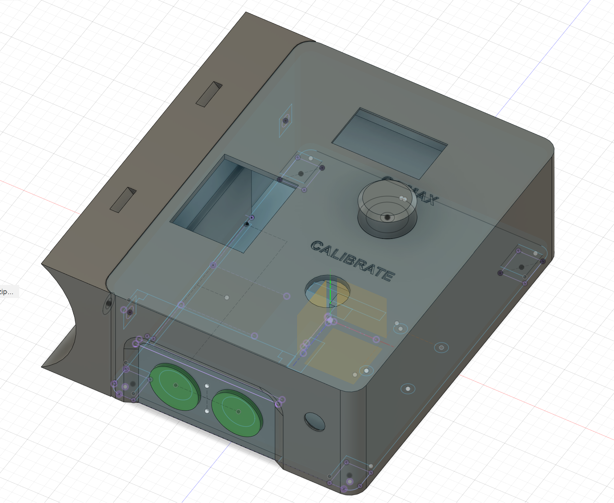
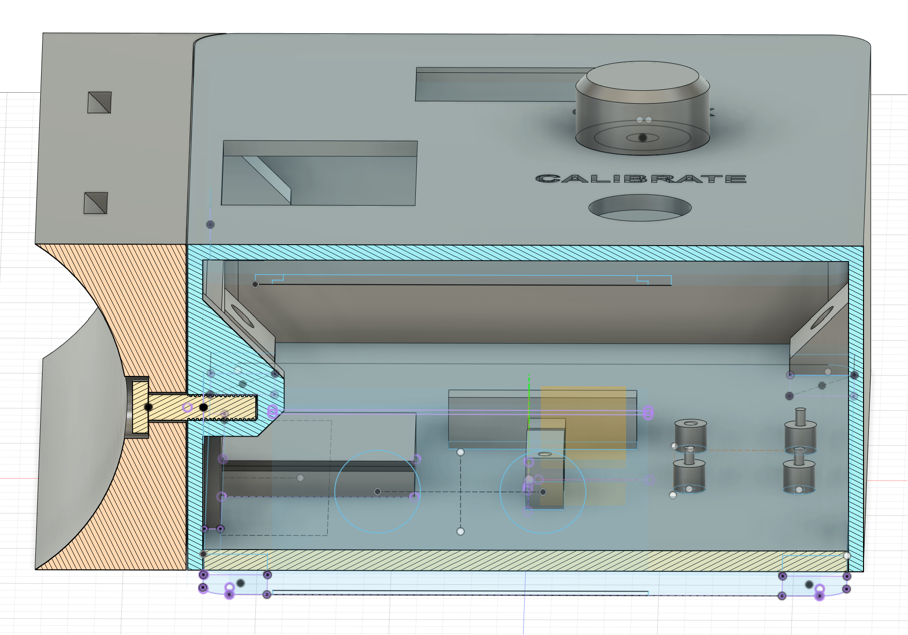
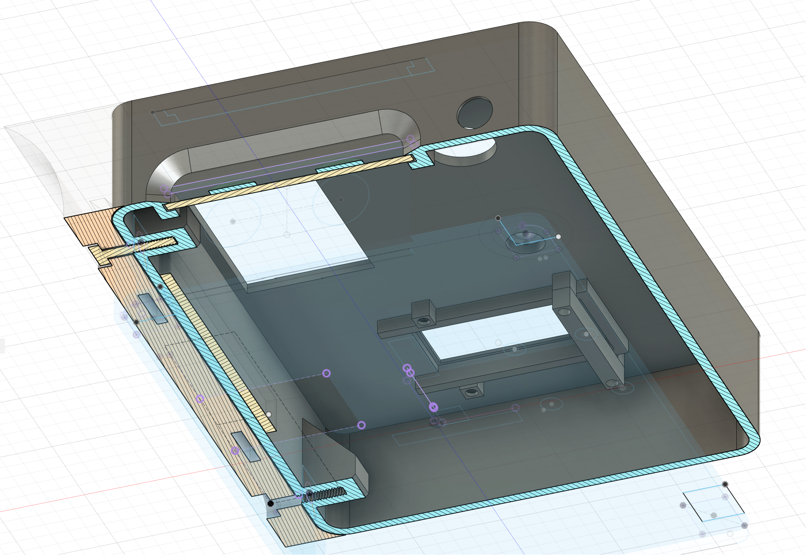
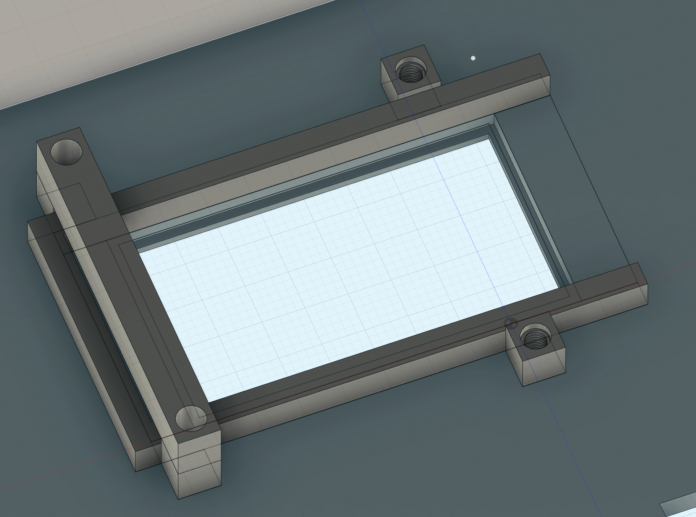

# DIY Continuous Nitrox blender

The blender is designed to measure the o2 mix passing over the o2 cells, if within accepted range `< EAN40 ` it activates a relay that will provide power to a NC solenoid, which controls the o2 feed from the o2 regulator into the blender stick.

The accepted EAN level is adjustable using a potentiometer, allowing adjustment between 0 and 40. 

> **The EAN40 limit is to prevent high O2 mix going in to the air compressor.**

The blender supports calibration as any time using a button. The calibration should be done when normal air flows over the o2 cell. The registered voltage is assumed to be 20.9 o2 level. The calibration levels are persisted to EEPROM storage and recovered on next power-on.

## Components

- LiLyGo T-Display S3
- ADS1115
- Potentiometer (Max EAN)
- Button (Calibration)
- [5v dc relay, 10 A at 250 VAC (srd-05vdc-sl-c)](https://www.velleman.eu/products/view?id=435570)
- Automatic breaker (230v)
- Powersupply (guts of usb-c phone charger 230->5v)
- [230v NC solenoid](https://www.elfadistrelec.no/en/way-solenoid-valve-smc-vx223ala/p/11027320) 

- Cable for connecting o2 cell to the ADS1115 (coax/smb)
- 3D printed stuff for control electronics & o2 cell mount
- Drainage pipe (7cm diameter) - blending stick
- Landhockey balls (inside drainage pipe for vortex/mixing)
- [Oxygen regulator (0-300bar -> 0-6 bar)](https://imelbu.no/product/regulator-aga-fixicontrol-hand-tight-oxygen/)
- Oxygen cell(s) (JJ-CCR ApS)

## Power

Since the solenoid valve requires 230v to operate it made most sense to include a breaker for main power supply.
The breaker output is hooked up to a gutted usb-c charger (to reduce space) and one pole to the supply contact on the relay (C).

The usb-c charger will provide power to the esp32 board through the usb-c input.

The relay will close the circuit to the solenoid when a `HIGH` signal is provided (normally closed). When the solenoid is powered it will allow oxygen to flow in to the blending stick.

## Oxygen cells
Since I have multiple "Rebreathing" friends and they need to replace oxygen cells every year, these are used 🙈. They still have more love to give after one year. Cells should be replaced when voltage drops below 8mV in normal air.

# Diagram

# Control box 

MAC: 
Nitrox: 34:85:18:71:47:D4
Client: 30:30:F9:34:8B:5C